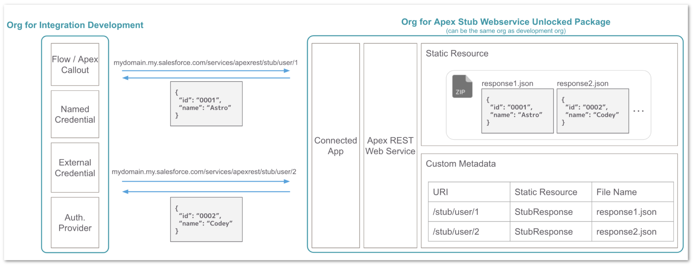
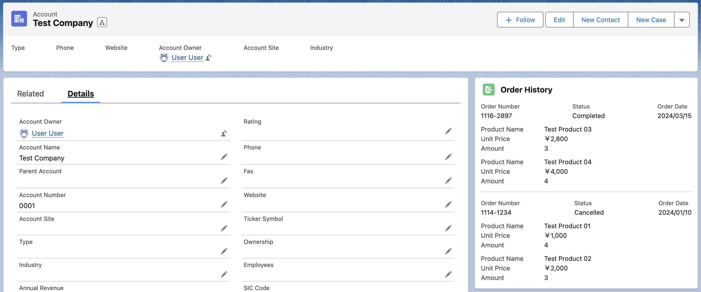

[English](README.md) | [日本語](README.ja.md)

# Apex スタブ Web サービス

簡単に設定できる Salesforce 上の スタブ API サーバパッケージです。連携先のシステムの API が利用できない場合などに、テスト目的で連携先の スタブ API を構築することが主なユースケースです。これは Salesforce 上の連携開発を効率的に進めるために開発されましたが、実態は Apex REST Web サービスのため、Salesforce 以外の他のシステムからコールするための スタブ API としても活用することができます。

## 設定手順

1. スクラッチ組織設定ファイルの機能に `"ZipSupportInApex"` を追加した上で新しいスクラッチ組織を作成します。

2. `stub-web-service` フォルダの資源をデプロイします。

3. 静的リソースに API レスポンスとなる JSON ファイルを束ねた zip ファイルをアップロードします。

4. カスタムメタデータ `Stub Web Service Setting` にレコードを追加して、パスとレスポンスの JSON ファイルの対応およびステータスコードを設定します。

5. https://YourDomain.my.salesforce.com/apexrest/stub/* が スタブ API のエンドポイントです。任意の方法でアクセストークンを取得し、この API をコールします。Salesforce 開発者の場合は、必要に応じて以下のサンプルアプリケーションの設定手順も参照してください。

## サンプルアプリケーションのための追加設定
実際の連携をイメージしやすくするために、以下では、連携開発用の組織とスタブ API 用組織を分けて手順を示していますが、これらは同じ 1 つの組織でも構いません。

### スタブ API 用の組織

1. `stub-web-service-sample` フォルダのメタデータをデプロイします。

2. 接続アプリケーション `Apex Stub Web Service` のコンシューマー鍵とコンシューマの秘密を控えます。後ほど他の設定で使用します。

### 連携開発用の組織

1. `app-sample` フォルダのメタデータをデプロイします。

2. 認証プロバイダ `Stub API` のコンシューマーの鍵とコンシューマーの秘密を、スタブ API 用組織の接続アプリケーションのコンシューマー鍵とコンシューマの秘密の値に設定し保存します。

3. コールバック URL を控えます。スタブ API 用組織の接続アプリケーションに戻り、コールバック URL 項目の値をこの値で更新します。

4. 指定ログイン情報 `Stub API` の URL をスタブ API 用組織の URL に更新します。

5. 外部ログイン情報 `Stub API` に移動し、 `Example` プリンシパルのアクションボタンから、[認証] をクリックします。

6. スタブ API 用の組織にログインし、アクセスを許可します。

7. 権限セット `Apex Stub Web Service Sample App` をユーザに割り当てます。

8. `Example Order History` コンポーネントを、取引先の Lightning レコードページの任意の場所に配置します。取引先番号を `0001`、`0002`、または `0003` に設定します。静的リソース内の JSON ファイルに基づいて注文履歴の表示を確認することができます。

