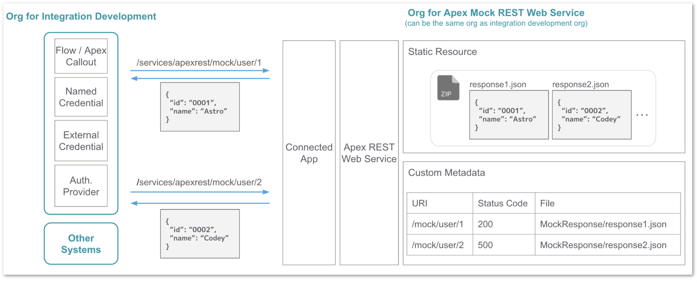

[English](README.md) | [日本語](README.ja.md)

# Apex Mock Web Service

A lightweight, portable, and customizable API mock for Salesforce development. The common use case is mocking a REST API for integration tests, for example, when you cannot wait until the actual API is available. This was originally developed to facilitate efficient integration development on Salesforce platform, but since it is actually an Apex REST web service, it can also be used as a API mock for calls from other systems besides Salesforce.

## Setup

1. Deploy `mock-web-service` folder in this repository.

2. Upload API mock responses as zipped csv filed to static resource.

3. Add records to custom metadata `Mock Web Service Setting` to manage the mapping between path and response, and status code.

4. https://yourdomain.my.salesforce.com/apexrest/mock/* is the endpoint of the API mock. Get an access token in any way and call the API. If you're developing an integration from Salesforce, see also the following the sample app setup steps.

## Optional Setup for Sample App
To make it easier to imagine an actual integration, the following steps shows separately for the integration development org and the API mock org, but they can be the same single org.

### Org for Mock Web service

1. Deploy `mock-web-service-sample` folder.

2. Copy consumer key and consumer secret of the Connected App named `Apex Mock Web Service`. You'll use them later.

### Org for Integration Development

1. Deploy `app-sample` folder in this repository.

2. Update consumer key and consumer secret field of the Auth. Provider named `Mock API`.

3. Copy `Callback URL`. Back to the org for mock web service and update the callback url field of the Connected App with it.

4. Update url of the named Named Credential `Mock API` with the org url for mock web service.

5. Navigate to the External Credential named `Mock API`. And click `Authenticate` under action button in `Example` principal.

6. Login to the org for mock web service and authorize access.

7. Assign permission set `Apex Mock Web Service Sample App` to your user.

8. Add `Example Order History` custom lighting component to an account record page and update standard `Account Number` field of an account to `0001`, `0002` or `0003`. You can see the order history based on the api mock response.

